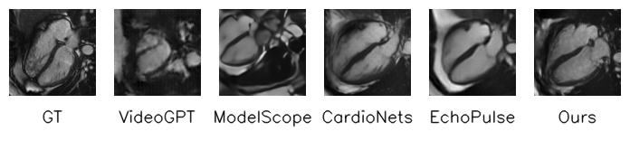
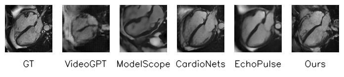
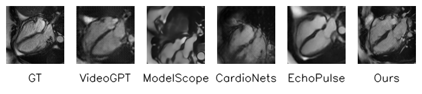
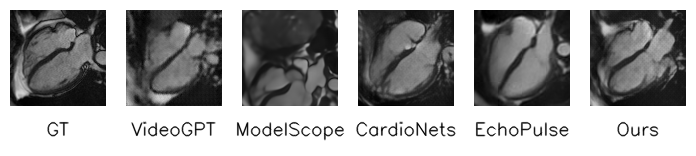

# ECGFlowCMR: Unlocking the Potential of ECG for Cine CMR Representation Learning via Generative Data Augmentation

### Abstract: 
Cardiac Magnetic Resonance (CMR) enables comprehensive evaluation of cardiac morphology and function but is constrained by high acquisition costs and the need for expert annotation, which limit large-scale data availability. In contrast, electrocardiograms (ECGs) are cost-effective, broadly accessible, and can serve as conditioning inputs for the generative synthesis of cine CMR. We propose ECGFlowCMR, a novel ECG-to-CMR generative framework that integrates a Phase-Aware Masked Autoencoder (PA-MAE) and an Anatomy-Motion Disentangled Flow (AMDF) to address two fundamental challenges: (1) the cross-modal temporal mismatch between multi-beat ECG recordings and single-cycle CMR sequences, and (2) the anatomical observability gap resulting from the limited structural information in ECG signals. Extensive experiments on the UK Biobank and a proprietary clinical dataset demonstrate that ECGFlowCMR generates realistic cine CMR sequences from ECG inputs, thereby enabling scalable pretraining and enhancing performance on downstream cardiac analysis tasks.

## 🎬 Demo





## ⚙️ ECGFlowCMR Training
1. Build environment from requirements.txt
2. Train the appropriate weights using your own dataset.

### Pretraining for Phase-Aware Masked Autoencoder:
```sh
python train_ecg.py
```
### Pretraining for 3D-VAE:
```sh
python train_disentangle_vae3d.py
```
### Training for Anatomy-Motion Disentangled Flow:
```sh
python train_flow.py
```
### Evaluation:
```sh
python evaluation.py
```

## 🚀 Quick Generation
You can use our pre-trained model weights for fast ECG to CMR.

### Generation:
```sh
python infer_flow.py
```

## 📝 Citation:
If you find our work interesting and helpful, please consider giving our repo a star. Additionally, if you would like to cite our work, please use the following format:
```sh
@misc{fang2026ecgflowcmrpretrainingecggeneratedcine,
      title={ECGFlowCMR: Pretraining with ECG-Generated Cine CMR Improves Cardiac Disease Classification and Phenotype Prediction}, 
      author={Xiaocheng Fang and Zhengyao Ding and Jieyi Cai and Yujie Xiao and Bo Liu and Jiarui Jin and Haoyu Wang and Guangkun Nie and Shun Huang and Ting Chen and Hongyan Li and Shenda Hong},
      year={2026},
      eprint={2601.20904},
      archivePrefix={arXiv},
      primaryClass={eess.IV},
      url={https://arxiv.org/abs/2601.20904}, 
}
```
